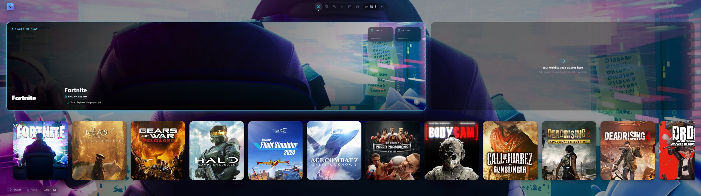

<p align="center">
  
</p>

<h1 align="center">MT3K Launcher</h1>

<p align="center">
  Launcher de juegos <em>controller-first</em> para Windows, basado en ORBIT de Luis Garcia.
</p>

<p align="center">
  <a href="https://github.com/MondoBoricua/mt3k-launcher/releases/latest"></a>
  <a href="https://github.com/MondoBoricua/mt3k-launcher/actions/workflows/build-windows.yml"></a>
  <a href="LICENSE"></a>
</p>

## Qué es esto

MT3K Launcher junta tu biblioteca de PC (Steam, Epic, GOG, Xbox, EA, Ubisoft, retro y juegos locales) en una pantalla de inicio estilo consola, pensada para mando, handhelds y TV. Es el launcher que MT3K prueba en su hardware y mejora en el canal.

Empezó como **ORBIT MT3K Edition**, un fork de ORBIT 0.1.4. En septiembre de 2026 el repositorio público de ORBIT desapareció de GitHub, así que el proyecto sigue por su cuenta con nombre propio. No está afiliado a ORBIT ni a su autor.

## Qué trae

| Función | Desde |
|---|---|
| **Soporte ultrawide y super-ultrawide en el Home** (2560×1080, 3440×1440, 5120×1440, también con escalado 125–150 %). La fila de juegos ya no se corta y muestra 8 a 12 juegos a la vez. Se envió a ORBIT como PR #13 y fue aceptado. | 0.1.4-mt3k.1 |
| **Bibliotecas de Steam en discos externos**: sin avisos falsos cuando el disco no está, y reescaneo automático al conectarlo o quitarlo. Aportado por nerdytyphanie. | 0.1.4-mt3k.1 |
| **Buscar metadatos por título** en el editor del juego: elige el resultado de Steam y rellena descripción, géneros, desarrollador, fecha y más. Ideal para juegos custom. | 0.1.4-mt3k.2 |
| **Arte de Steam para juegos recientes**: la búsqueda sin API key encuentra portada, fondo y cabecera en las rutas nuevas de Steam. | 0.1.4-mt3k.2 |
| **Funciones Plus incluidas**: temas, layout Cuadro, movimiento del fondo, música y sonidos propios, selector de próximo juego, guías de logros y cloud gaming, sin cuenta ni licencia. | 0.1.4-mt3k.4 |
| **Actualizaciones dentro de la app**: cuando sale una release nueva aparece una pantalla para actualizar. La descarga se verifica y la app se reinicia sola, también en Xbox Mode. | 0.1.4-mt3k.4 |
| **Xbox Mode desde el instalador**: al terminar la instalación ofrece registrarse como app de inicio de Xbox Mode y mantiene el registro al día. | 0.1.4-mt3k.5 |
| **"Iniciar con Windows" arreglado** en instalaciones con espacios en la ruta. | 0.1.4-mt3k.5 |
| **Nombre e identidad propios**: MT3K Launcher, con ícono nuevo, sin perder datos al actualizar desde la MT3K Edition. | 0.1.4-mt3k.6 |

El detalle por versión está en [CHANGELOG.md](CHANGELOG.md).

## Descargar e instalar

1. Baja `MT3K-Launcher-Setup-<versión>-x64.exe` de la [última release](https://github.com/MondoBoricua/mt3k-launcher/releases/latest).
2. Comprueba el hash contra `SHA256SUMS.txt` de la misma release:
   ```powershell
   Get-FileHash .\MT3K-Launcher-Setup-0.1.4-mt3k.6-x64.exe -Algorithm SHA256
   ```
3. Ejecuta el instalador. **No está firmado con certificado**, así que SmartScreen avisará una vez: *Más información → Ejecutar de todas formas*.

Requisitos: Windows 11 x64. Mando recomendado, teclado y ratón soportados.

**Si venías de ORBIT MT3K Edition:** actualiza desde la app o instala encima. Se conservan la biblioteca, los ajustes, la carpeta `Documentos\ORBIT` de emuladores y ROMs, y el registro de Xbox Mode. Por compatibilidad, el ejecutable sigue llamándose `ORBIT.exe` y los datos siguen en `%APPDATA%\ORBIT`. Las releases publican también copias `ORBIT-MT3K-*` de los mismos archivos para que las versiones anteriores encuentren la actualización.

**Detalles de esta build:**

- **Sin firma de código.** Las actualizaciones se verifican con el SHA-256 que GitHub publica para cada archivo.
- **Sin Discord Social SDK.** El binario de Discord es propietario y no está en el repositorio, así que la presencia de Discord queda desactivada.
- **Funciones Plus.** En ORBIT, Plus es una membresía de pago. MT3K Launcher las activa en local, sin contactar Patreon, Gumroad ni ningún servidor, así que no hay pestaña de Plus ni nada que activar.

## Xbox Mode (experimental)

Windows solo ofrece en *Configuración → Gaming → Xbox mode → Choose home app* las apps empaquetadas que se declaran como "Gaming Home". MT3K Launcher se registra con esa declaración usando el modo desarrollador de Windows, sin firma.

Requisitos: Windows 11 24H2 o más nuevo y **modo desarrollador activado** (*Configuración → Sistema → Para desarrolladores*).

**Opción 1, desde el instalador.**

1. Instala `MT3K-Launcher-Setup`. Al terminar pregunta si quieres registrarlo en Xbox Mode: di que sí.
2. Si el modo desarrollador está apagado, el instalador abre esa página de Configuración. Actívalo y pulsa *OK*.
3. En *Choose home app* elige **MT3K Launcher**.

Las versiones nuevas mantienen el registro al día sin preguntar. Si algo falla, el detalle queda en `%TEMP%\mt3k-launcher-xbox-mode.log`.

**Opción 2, con un comando.** Si el instalador no pudo registrarlo, abre PowerShell en el propio equipo, con MT3K Launcher cerrado, y pega:

```powershell
$ProgressPreference='SilentlyContinue'; $d="$env:TEMP\mt3k-launcher"; Invoke-WebRequest https://github.com/MondoBoricua/mt3k-launcher/archive/refs/heads/mt3k.zip -OutFile "$d.zip"; Expand-Archive "$d.zip" $d -Force; powershell -ExecutionPolicy Bypass -File "$d\mt3k-launcher-mt3k\scripts\windows\Register-Mt3kLauncherXboxMode.ps1"
```

Luego elige **MT3K Launcher** en *Choose home app*.

Para quitarlo, desinstala MT3K Launcher o ejecuta el script con `-Remove`. La app registrada puede pedir el onboarding de nuevo porque Windows le da su propia carpeta de datos.

## Cómo está organizado el repositorio

| Rama | Para qué |
|---|---|
| `mt3k` | Rama principal. De aquí salen las builds y las releases. |
| `main` | Código de ORBIT 0.1.4 tal como estaba antes de los cambios. Queda como referencia; no se actualiza. |
| `feat/*` | Cambios en desarrollo, uno por rama, que se mezclan en `mt3k`. |

## Compilar

Necesitas Node.js 22 o más nuevo y Windows para el instalador. El renderer y los chequeos corren también en macOS y Linux.

```bash
npm ci
npm run typecheck
npm run build
# Correr sin empaquetar:
npx electron .
# Instalador NSIS sin firma:
npx electron-builder --win nsis --x64 --config electron-builder.mt3k.yml --publish never
```

El instalador queda en `release/`. En GitHub Actions, cada push a `mt3k` deja el instalador como artefacto del workflow [`build-windows`](.github/workflows/build-windows.yml). Una etiqueta con el formato `v0.1.4-mt3k.N` publica una release con el instalador, el zip de la app para Xbox Mode, `latest.yml` y `SHA256SUMS.txt`.

### Verificar el Home en distintos tamaños

El proyecto trae un harness que monta el Home real con datos de prueba en una ventana Electron offscreen y saca capturas:

```bash
npm run build
npx electron scripts/verify-settings-navigation.cjs --orbit-home
```

Las capturas quedan en `.codex-qa/settings-navigation/`. El modo `--orbit-home` valida 1280×720, 1920×1080 y los tamaños ultrawide (3413×960, 2560×1080, 3440×1440, 5120×1440) para los tres tamaños de tarjeta.

## Ideas en cola

- Layouts XMODE, CoreSense y Rolling en 32:9.
- Ajustes para el ROG Xbox Ally con eGPU, como un perfil de resolución al conectar y desconectar el dock.
- Más pruebas con mandos de terceros.

Si tienes una idea o un bug en tu hardware, abre un [issue](https://github.com/MondoBoricua/mt3k-launcher/issues) con tu resolución, escalado de Windows y layout del Home.

## Licencia y créditos

MT3K Launcher es software libre bajo la [GNU GPL v3](LICENSE), con la [excepción para el Discord Social SDK](LICENSE_EXCEPTION.md) heredada de ORBIT. Puedes usarlo, estudiarlo, modificarlo y redistribuirlo bajo los mismos términos, y el código fuente de cada build está en este repositorio.

- **ORBIT**, la base de este proyecto: © Luis Garcia. [Sitio oficial](https://www.getorbitlauncher.com/).
- **MT3K Launcher**, los cambios y el nombre nuevo: © MT3K.
- **Terceros**: [THIRD_PARTY_NOTICES.md](THIRD_PARTY_NOTICES.md).

---

**English.** MT3K Launcher is a controller-first game launcher for Windows based on ORBIT by Luis Garcia. It started as the ORBIT MT3K Edition fork of ORBIT 0.1.4 and continues independently since ORBIT's public repository disappeared in September 2026; it is not affiliated with ORBIT or its author. It adds ultrawide / 32:9 Home support, Steam removable-drive fixes, Steam metadata search, locally unlocked Plus features, in-app updates verified against GitHub's SHA-256 digests, and an experimental Xbox Mode registration through Windows Developer Mode that the installer offers. Updating from the MT3K Edition keeps your library, settings and Xbox Mode registration. GPL-3.0; no Discord SDK in these builds. See [CHANGELOG.md](CHANGELOG.md).
